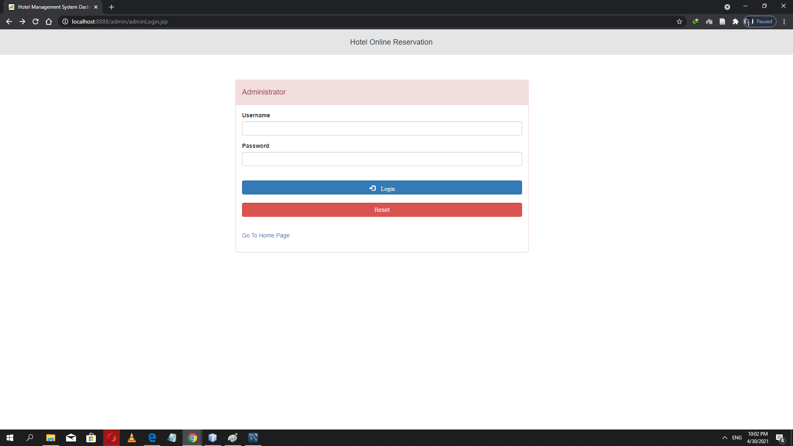

<!-- TABLE OF CONTENTS -->

  
Table of Contents

  <ol>
    <li>
      <a href="#about-the-project">About The Project</a>
      <ul>
        <li><a href="#built-with">Built With</a></li>
      </ul>
    </li>
    <li>
      <a href="#getting-started">Getting Started</a>
      <ul>
        <li><a href="#prerequisites">Prerequisites</a></li>
      </ul>
    </li>
    <li><a href="#Team_Members">Project Team</a></li>
    <li><a href="#contact">Contact</a></li>
  </ol>

<!-- ABOUT THE PROJECT -->
## About The Project
<h4>Client Home Page</h4>

<h4>admin login page</h4>

<h3>Hotel Reservation system</h3> 

Description: Most of us know the popular travel reservation website booking.com  
You are required to develop similar web application  

User groups: 
There are two user groups which are client (a person who wants to book a hotel room) and hotel reservation admin (a person who is responsible to manage reservations) and we use Model-View-Controller (MVC) pattern in development.

<h3>General Requirements:</h3> 

1. Every project must include mechanisms for signing up, signing in, and signing out. 
2. Signing up process should include the following 
    a. The form must use a captcha whether online or offline like “google captcha” …etc. 
    b. During the registration the user will not supply a password
    c. After the form submission an email will be sent to the user with a generated temporary password to login the  application with it. 
3. All users should be able to change their information in the profile page like password, display name…etc. except for the username. 
4. Sessions must be enforced with the user’s interaction. 
5. The project must use a unified CSS style for all the pages you can build your own or. 
6. Ajax should be used in at least three different scenarios including signing up (to check if the user registered before). 
7. All input forms must be validated either by using HTML5 controls, Java script or jQuery 
8. Every interaction from the user must be presented with a proper feedback from the system like success / failure messages, alert…etc. 
9. Usage of “Hibernate” for the DB communication is encouraged. 
10. Meaningful data examples should be present in your database at least five examples in every table are presented. 
11. The word “Manage” in the requirements is translated to all the CRUD operations (Insert/add – Update – Delete – Select) 

<h3>Main functional requirements: For client (user group)</h3> 

1. Search for a hotel in which user needs to specify (where he/she is going, the check-in date, check-out date as well as the number of adults and children).
2.  View a list of hotels according to user research along with enough information about the hotel (such as hotel name, hotel rating, availability, expected price ... etc.) 
3.  Client should be able to choose one of the search-result hotels and see more information about it (rooms available, room type, room facilities etc.) 
4.  View hotel photos 
5.  Client can filter hotels search-result by these categories (price, user rating, hotel’s stars, distance from the governorate city center, including meals, etc.) 
6.  Client should be able to view the hotel on Google maps 
7.  Make a hotel reservation.
8.  Change / Cancel reservation. 
9.  Rate Hotel (stars system and comments) 
 
<h3>For hotel reservation admin (user group) </h3>

1.  Check clients in and out. 
2.  View a list of reservations (current) 
3.  View reservation history for a specific period (from date – to date) 
4.  Search for a client and view his / her information (for example user phone number as well as email) in case s/he needs to contact the client and confirm reservation. 
5.  Cancel reservation 
6.  Get notification upon client cancellation by email (real email message – can use java mail or any other email libraries) and on the system 
7.  Confirm reservation payment 
8.  Update hotel basic information (contact information, hotel facilities, add location, other branches information) 
9.  Upload and update hotel photos 
10. Add / update room information   
11. View hotel rating and client’s comments 

### Built With

* [jsp](https://www.tutorialspoint.com/jsp/index.htm)
* [java servlet](https://www.javatpoint.com/servlet-tutorial)
* [Bootstrap](https://getbootstrap.com)
* [HTML5](https://www.w3schools.com/html/)
* [CSS](https://www.w3schools.com/css/)
* [JQuery](https://jquery.com)
* [MYSQL](https://www.mysql.com)
* [javascript](https://www.javatpoint.com/javascript-tutorial)
* [AJax](https://www.w3schools.com/js/js_ajax_intro.asp)

<!-- GETTING STARTED -->
## Getting Started 

  Hotel Reservation system project is resposive website contain two project inside it frist part is client and second part is admin dashboard all features that client and admin make it is found in <a href="#about-the-project">About The Project</a> section. 
  Hotel Reservation system is jave many featues like <a href="https://www.booking.com">Booking.com</a> 

### Prerequisites
we use Netbeans 8.1 as a programming tool and we use a jar files as a libraries so import this jar files in netbeans and we use mysql workbench 8.0 
so you should to install this tools to run this project.

list things you need to use the software and how to Run them.
* Netbeans 8.1
* mysql workbench 8.0
* import jar files as a libraries in Netbeans

<!-- CONTRIBUTING -->
## Team_Members
<a href="https://github.com/MGMK">Mohamed Hamdy</a> 
<a href="https://github.com/ahmad-Gommah">Ahmad Gomma</a> 
<a href="https://github.com/mhmd19?fbclid=IwAR1RjmI84zQG3enIW02HziSOh7cChlgwFzKhZhQsWyJBXzamC4Xmzw-2Lsw">Mohame Ali</a>

<!-- CONTACT -->
## Contact
Team Members :

Mohamed Hamdy Mohamed - [@LinkedIn](https://www.linkedin.com/in/mohamed-hamdy-0155b2173/) - LinkedIn 
Ahmad Gomma Farouk - [@LinkedIn](https://www.linkedin.com/in/ahmad-gomma-3873441aa/) - LinkedIn 
Mohamed Ali Farouk - [@LinkedIn](https://www.linkedin.com/in/mohamed-ali-b42320185/) - LinkedIn

